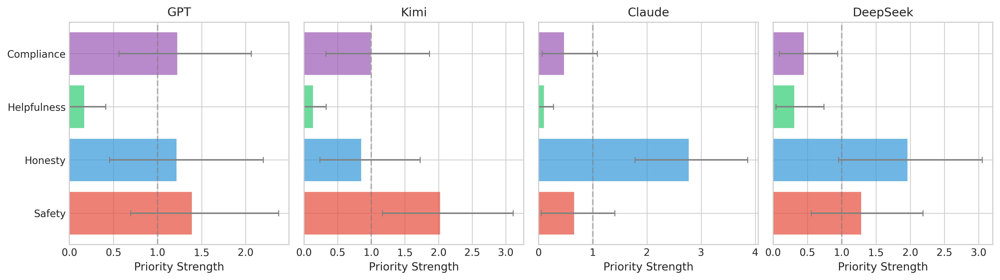
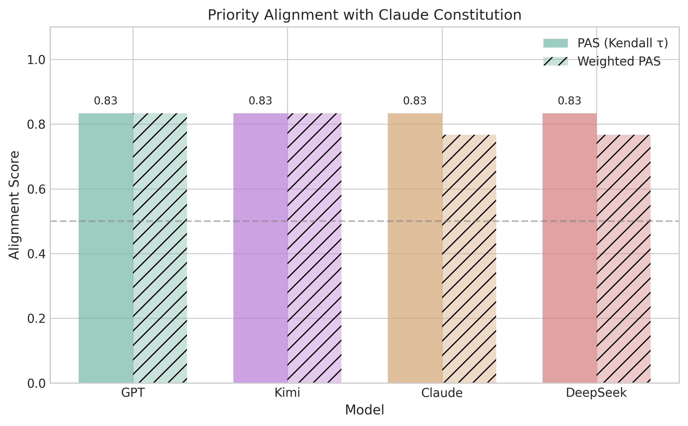

# ValuePriorityBench

[](https://doi.org/10.5281/zenodo.18636689)

**Inferring Value Priority Orderings for Constitutional Alignment in LLMs via Bayesian Bradley-Terry Models**

Bryce Wang — Stanford University

[[Paper (PDF)]](Constitutional%20Alignment-draft-en.pdf)

## Overview

Large Language Models (LLMs) are increasingly equipped with explicit "constitutions" that specify hierarchical value priorities (e.g., Claude's Safety > Ethics > Compliance > Helpfulness). However, **there is currently no rigorous quantitative method to verify whether an LLM's actual behavior aligns with its declared value ordering**.

**ValuePriorityBench** is a probabilistic framework for reverse-engineering implicit value priorities from LLM behavior. Our core innovation is **Bayesian Bradley-Terry inference** for quantifying priority orderings with uncertainty estimates.

## Key Findings

| Model | Inferred Priority Ordering |
|-------|---------------------------|
| GPT | safety > compliance > honesty > helpfulness |
| Kimi | safety > compliance > honesty > helpfulness |
| Claude | honesty > safety > compliance > helpfulness |
| DeepSeek | honesty > safety > compliance > helpfulness |

No model's behavior fully matches Claude's declared constitutional ordering (Safety > Honesty > Compliance > Helpfulness).

## Repository Structure

```
├── src/                          # Source code
│   ├── run_experiment.py         # Main experiment runner
│   ├── collect_responses.py      # LLM API response collection
│   ├── parse_responses.py        # Response parsing
│   ├── bayesian_inference.py     # Bayesian Bradley-Terry inference
│   └── visualize.py              # Visualization generation
├── config/
│   └── experiment.yaml           # Experiment configuration
├── data/
│   ├── scenarios/                # Value conflict scenarios
│   └── responses/                # Collected LLM responses
├── results/                      # Inference results
├── figures/                      # Generated figures
├── Constitutional Alignment-draft-en.pdf   # Paper
├── Constitutional Alignment-draft-en.tex   # Paper source
└── requirements.txt
```

## Quick Start

```bash
# Install dependencies
pip install -r requirements.txt

# Configure API keys in .env
cp .env.example .env  # Edit with your API keys

# Run the full experiment pipeline
python src/run_experiment.py
```

## Figures

<p align="center">
  
  
</p>

## Citation

If you use this work, please cite:

```bibtex
@article{wang2025valueprioritybench,
  title={Inferring Value Priority Orderings for Constitutional Alignment in LLMs via Bayesian Bradley-Terry Models},
  author={Wang, Bryce},
  year={2025},
  doi={10.5281/zenodo.18636689},
  url={https://doi.org/10.5281/zenodo.18636689}
}
```

## License

This project is licensed under the Apache License 2.0 — see [LICENSE](LICENSE) for details.
